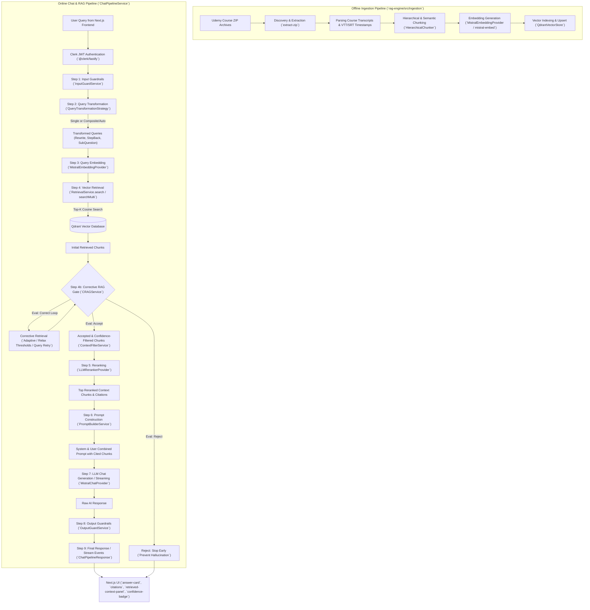

# Udemy AI Knowledge Engine — Advanced RAG Architecture

A production-ready, highly modular Retrieval-Augmented Generation (RAG) Knowledge Engine specifically engineered for Udemy course transcripts and structured learning materials. Built with strict **TypeScript**, **Fastify**, and **Next.js 16**, the system features multi-stage query transformation, Corrective RAG (CRAG) quality gates, LLM reranking, and multi-layer input/output guardrails using **Mistral AI** and **Qdrant Vector Database**.

---

## 🏗️ System Architecture & Technology Stack

The project follows a clean monorepo architecture divided into two core packages: the backend engine (`rag-engine`) and the interactive frontend (`web`).

```
udemy-bot-rag-advanced/
├── rag-engine/             # Fastify v5 Backend Knowledge Engine & Offline Pipeline
│   ├── src/api/            # HTTP layer (Fastify routes, controllers, Clerk auth middleware)
│   ├── src/config/         # Centralized Zod-validated environment configuration
│   ├── src/core/           # Domain contracts, models, and Clean Architecture abstractions
│   ├── src/crag/           # Corrective RAG (evaluators, corrective loop, filtering, retry policy)
│   ├── src/guardrails/     # Input & Output guardrail validation and sanitization
│   ├── src/ingestion/      # Offline processing (discovery, extraction, parsing, chunking, embedding)
│   ├── src/prompts/        # Prompt engineering and context combining
│   ├── src/providers/      # Adapters for Mistral AI (Chat & Embeddings) and Qdrant Vector Store
│   ├── src/query/          # Query transformation strategies and selectors
│   ├── src/reranking/      # Reranking providers and services
│   ├── src/retrieval/      # Vector search interfaces and multi-query execution
│   └── src/shared/         # Structured Pino logging, errors, and cross-cutting utilities
└── web/                    # Next.js 16 Frontend Web Application
    ├── src/app/            # App Router pages and layout (`/chat`, `/sign-in`, etc.)
    ├── src/components/     # Interactive UI (retrieved context panel, citations, pipeline progress)
    └── src/lib/            # API proxies, query client, and TypeScript definitions
```

### Core Technologies Used
- **Backend Runtime & Framework**: Node.js 22+, TypeScript 5 (Strict Mode), **Fastify v5**
- **Frontend Framework**: **Next.js 16** (App Router, React 19), **Tailwind CSS v4**, **shadcn/ui**, **TanStack React Query**
- **Authentication**: **Clerk** (`@clerk/fastify` on backend, `@clerk/nextjs` on frontend)
- **Vector Database**: **Qdrant** (`@qdrant/js-client-rest`) with Cosine distance metric
- **AI & Embedding Provider**: **Mistral AI** (`mistral-medium-latest`, `mistral-small-latest`, `mistral-embed`)
- **Validation & Type Safety**: **Zod** schema validation across all environment variables, payloads, and guardrails
- **Logging**: **Pino** (`pino` + `pino-pretty`) for high-performance structured logging
- **Testing & Quality**: **Vitest**, **ESLint v9 Flat Config**, **Prettier**

---

## 🔄 Full RAG Pipeline Diagram

The entire Retrieval-Augmented Generation pipeline is structured into two distinct phases: the **Offline Ingestion Pipeline** (processing raw Udemy course ZIP archives into Qdrant) and the **Online Chat & RAG Pipeline** (handling live queries with transformations, CRAG quality gates, reranking, and guardrails).

### Full RAG Pipeline Architecture



---

## ⚙️ Detailed Pipeline Components

### 1. Offline Ingestion Pipeline (`src/ingestion`)
- **Discovery (`discovery`)**: Scans specific directory locations for compressed course archives (`.zip`).
- **Extraction (`extraction`) & Parsing (`parsing`)**: Extracts `VTT`/`SRT` transcript files and extracts precise course metadata (course title, section names, lecture names, start/end timestamps).
- **Manifest Tracking (`manifest`)**: Builds a deterministic `manifest.json` verifying checksums (`SHA-256`) and tracking indexing progress to prevent duplicate processing.
- **Hierarchical Chunking (`chunking`)**: Splits course text using semantic/hierarchical boundaries while retaining rich metadata (`courseTitle`, `lectureTitle`, `chunkIndex`, timestamps) for accurate citations.
- **Embedding & Upsert (`embeddings`, `indexing`, `vectorstore`)**: Generates 1024-dimensional vectors via Mistral's `mistral-embed` model and stores payloads inside Qdrant (`knowledge-base` collection) with Cosine distance indexing.

---

### 2. Online Chat Pipeline (`src/chat/ChatPipelineService.ts`)

#### Step 1: Input Guardrails (`InputGuardService`)
Before touching any AI model or vector store, user queries pass through a multi-layered validation guard to sanitize input and prevent attacks:
- **Max Query Length Check** (`INPUT_MAX_QUERY_LENGTH`)
- **Prompt Injection & Jailbreak Defense** (`ENABLE_PROMPT_INJECTION_GUARD`, `ENABLE_JAILBREAK_GUARD`)
- **Security Protections**: SQL injection, XSS, Path Traversal, Spam, and PII detection.

#### Step 2: Query Transformation (`QueryTransformationStrategySelector`)
Improves retrieval recall by overcoming phrasing mismatches using pluggable transformation strategies:
- **`NoOpStrategy`**: Passes raw query directly.
- **`RewriteStrategy`**: Uses `mistral-small-latest` to rephrase ambiguity into clear search terms.
- **`StepBackStrategy`**: Generates a higher-level concept query to retrieve broad principles alongside specific facts.
- **`SubQuestionStrategy`**: Deconstructs complex multi-part questions into targeted sub-queries.
- **`CompositeStrategy` (`auto` / `all`)**: Concurrently executes multiple strategies (`Rewrite`, `StepBack`, `SubQuestion`), deduplicates outputs, and passes all unique queries to the retrieval service.

#### Step 3 & 4: Multi-Query Embedding & Retrieval (`RetrievalService`)
- Embeds all unique transformed queries using `MistralEmbeddingProvider`.
- Executes parallel vector search (`searchMulti`) against **Qdrant Vector Store** with customizable `topK` and metadata filters (e.g., filtering by course or section).
- Aggregates, scores, and deduplicates retrieved chunks across queries.

#### Step 4b: Corrective Retrieval-Augmented Generation (`CRAGService`)
A robust quality assurance layer (`CRAGService.process`) that evaluates retrieved context *before* feeding it to the main generation model:
- **Retrieval Evaluation (`CRAGEvaluatorFactory`)**: Evaluates chunks using similarity scores, LLM grading, or a `hybrid` strategy.
- **Decision Pathways (`CRAGDecision`)**:
  - **`accept`**: Chunks meet high similarity/confidence thresholds (`minChunkConfidence`). Passed forward.
  - **`correct` (Corrective Loop)**: Triggers `CorrectiveRetrievalService` with `CRAGRetryPolicy`. Dynamically adapts query or relaxes thresholds up to `maxRetries` times to salvage relevant context.
  - **`reject`**: If context quality remains insufficient after retries, the pipeline stops immediately without invoking the chat LLM. Returns a safe fallback response to guarantee **zero hallucinations**.

#### Step 5: Context Reranking (`RerankerProvider`)
- **`LLMRerankerProvider`**: Re-orders accepted context chunks based on semantic relevance to the specific query using Mistral models (`RerankerProviderFactory`).
- Ensures that the most critical snippets are positioned at the top of the context window (`rerankerTopK`).

#### Step 6: Prompt Construction (`PromptBuilderService`)
- Formats system instructions (`ChatRole.SYSTEM`) and structures user prompts (`ChatRole.USER`).
- Embeds clear citation references (`[Citation ID: Course -> Lecture (Time)]`) alongside exact transcript text so the LLM can precisely attribute facts.

#### Step 7: Chat Completion & Streaming (`MistralChatProvider`)
- Communicates with Mistral API (`mistral-medium-latest`) using either synchronous completion or Server-Sent Events (`stream` / `streamResponse`).
- Yields structured `ChatStreamEvent` tokens (`start`, `citation`, `token`, `done`) with real-time latency and quality metrics.

#### Step 8: Output Guardrails (`OutputGuardService`)
Sanitizes the generated LLM response before returning to the client:
- Verifies maximum response length and prevents empty outputs.
- Checks against prompt leakage, sensitive data exposure, and hallucinated citations (`ENABLE_HALLUCINATED_CITATION_GUARD`).

#### Step 9: Frontend Delivery & Visualization (`web/`)
The Next.js 16 client receives the response/stream and renders:
- **Markdown Answer (`markdown-renderer.tsx`, `answer-card.tsx`)**: Formatted response with inline citations.
- **Retrieved Context Panel (`retrieved-context-panel.tsx`)**: Expandable panel allowing users to inspect exact course transcripts and lecture timestamps.
- **Confidence Badges & Statistics (`confidence-badge.tsx`, `statistics-card.tsx`)**: Visual display of CRAG quality decisions, similarity scores, and execution latency.

---

## 🚀 Getting Started

### Prerequisites
- **Node.js**: v22+
- **Package Manager**: `pnpm`
- **Vector Database**: Running instance of **Qdrant** (e.g., via Docker `compose.yml` or Qdrant Cloud)
- **API Keys**: **Mistral AI** (`MISTRAL_API_KEY`) & **Clerk** authentication keys

### 1. Backend Setup (`rag-engine`)
```bash
cd rag-engine

# Install dependencies
pnpm install

# Copy environment template
cp .env.example .env
# Edit .env with your MISTRAL_API_KEY, QDRANT_URL, and CLERK keys

# Start development server with live reload (http://localhost:3001)
pnpm dev
```

### 2. Frontend Setup (`web`)
```bash
cd web

# Install dependencies
pnpm install

# Copy environment configuration
cp .env.example .env.local
# Ensure NEXT_PUBLIC_CLERK_PUBLISHABLE_KEY and API endpoint URLs are configured

# Start Next.js development server (http://localhost:3000)
pnpm dev
```

### 3. Available CLI Commands (Backend `rag-engine`)
| Command | Description |
| :--- | :--- |
| `pnpm dev` | Starts the Fastify API server in development watch mode |
| `pnpm build` | Compiles strict TypeScript to `dist/` with alias resolution |
| `pnpm discover` | Discovers course ZIP archives inside the configured `data/` directory |
| `pnpm extract` | Extracts VTT/SRT files and course structures from discovered archives |
| `pnpm parse` | Parses transcript files and validates timestamps |
| `pnpm chunk` | Runs hierarchical chunking across parsed transcripts |
| `pnpm embed` | Generates Mistral vector embeddings for all document chunks |
| `pnpm ingest` / `index` | Full pipeline: indexes embedded chunks into Qdrant vector store |
| `pnpm search` | Executes test vector searches against Qdrant |
| `pnpm test` | Runs the automated Vitest unit & integration test suite |
