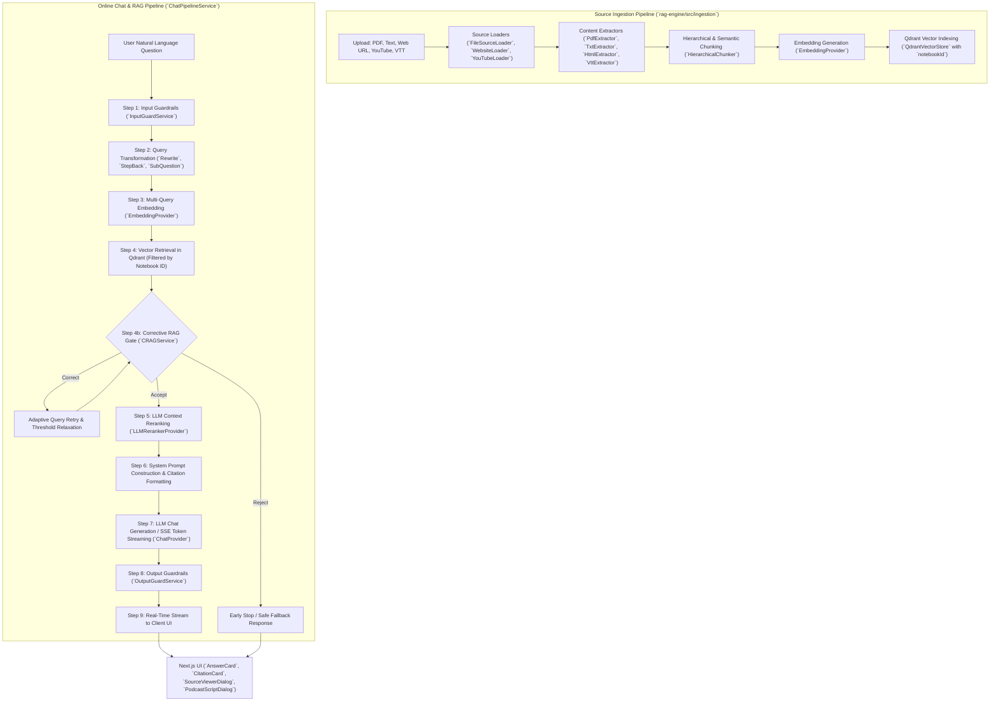

# 📚 ChaibookLM — AI-Powered Research & Knowledge Assistant

An advanced, production-ready Retrieval-Augmented Generation (RAG) knowledge engine inspired by **Gemini Notebook / NotebookLM**. ChaibookLM allows users to create isolated notebook workspaces, ingest multi-format knowledge sources (PDF, Plain Text, Websites, YouTube videos, VTT transcripts), ask natural language questions with real-time streaming, receive grounded answers with precise inline citations, inspect sources in interactive viewers, and generate audio podcasts and personalized learning roadmaps.

Built with strict **TypeScript**, **Fastify v5**, **Next.js 16 (App Router, React 19)**, **Tailwind CSS v4**, **Qdrant Vector Database**, and **LLM / AI Integration**.

---

## 🌟 Key Features

### 1. 🗂️ Notebook & Workspace Management
- **Isolated Workspaces**: Create, rename, delete, search, and manage isolated notebooks.
- **Strict Knowledge Isolation**: Every notebook maintains its own isolated knowledge base in Qdrant via metadata payload scoping (`notebookId`).
- **Clean Bento Grid UX**: Modern minimal high-contrast theme (Cobalt-Orange palette `#121212` canvas with `#F2A23A` accent).

### 2. 📥 Multi-Format Source Ingestion Pipeline
Supports 5 distinct knowledge source formats with automatic content extraction, hierarchical chunking, vector embedding, and Qdrant vector indexing:
- 📄 **PDF Documents**: Page-level and section text extraction via `PdfExtractor`.
- 📝 **Plain Text / Markdown**: `.txt` and `.md` file parsing via `TxtExtractor`.
- 🌐 **Website URLs**: HTML scraping, DOM cleaning, and text extraction via `WebsiteLoader` and `HtmlExtractor`.
- 📹 **YouTube Videos & Playlists**: Automatic metadata, title, and timed subtitle/transcript ingestion via `YouTubeLoader`.
- ⏱️ **VTT / Transcript Files**: WebVTT cue parsing with exact timestamp markers via `VttExtractor`.
- **Indexing Status Feedback**: Clear progress badges (`UPLOADING` → `INDEXING` → `READY` → `FAILED`) with progress bars and toast alerts.
- **Source Management**: One-click source deletion, metadata inspection drawer, and re-indexing pipeline trigger.

### 3. 🧠 Advanced RAG Engine & Quality Controls (`rag-engine`)
- **Hierarchical & Semantic Chunking**: Splits text into optimal context windows while retaining section titles, line numbers, page numbers, and time ranges.
- **Vector Embeddings**: High-dimensional vector embeddings generated using dense embedding models.
- **Query Transformation Strategies**: Multi-query expansion (`Rewrite`, `StepBack`, `SubQuestion`, and Composite selector) to maximize retrieval recall.
- **Corrective RAG (CRAG) Gate**: `CRAGService` evaluates retrieved context relevance before LLM generation. Automatically adapts queries, relaxes similarity thresholds, or returns safe fallback responses to guarantee zero hallucinations.
- **LLM Context Reranking**: `LLMRerankerProvider` re-scores and re-orders accepted chunks so the most relevant context sits at the top of the prompt window.
- **Multi-Layer Guardrails**: Input guards (prompt injection, jailbreak defense, max length, PII detection) and Output guards (citation verification, response length validation).
- **Server-Sent Events (SSE) Streaming**: Low-latency token-by-token streaming using LLM Chat providers.

### 4. 🔍 Inline Citations & Interactive Source Viewer
- **Inline Citations**: Every AI response includes clickable citation chips `[Citation ID]` referencing the exact title, page, line, or timestamp.
- **Interactive Source Viewer**:
  - 📄 **PDF**: `PdfHighlightViewer` renders PDF pages with cited section highlights.
  - 🌐 **Websites**: Preview drawer with clean formatted text and direct URL navigation.
  - 📹 **YouTube**: Embedded responsive player auto-seeking to cited video timestamps (`?t=seconds`).
  - 📝 **Plain Text**: Highlighted text chunk viewer with line matching.
  - ⏱️ **VTT Transcripts**: Highlighted time-aligned audio transcript cues.

### 5. 🎙️ Bonus AI Artifact Studios
- 🎧 **AI Audio Podcast Studio**: Synthesizes a two-speaker host dialogue podcast (male & female voice roles) from notebook sources with an interactive Web Speech API player, playback speed controls, transcript toggle, and text script download.
- 🛣️ **Personalized Learning Path & Roadmap**: Generates interactive concept roadmaps with deep-linked YouTube video timestamps and source citations.
- 🃏 **Interactive AI Flashcards**: Auto-generates study flashcards from knowledge sources for active recall practice.

---

## 🏗️ System Architecture & Technology Stack

The project follows a clean monorepo architecture divided into backend engine (`rag-engine`) and interactive client (`web`).

```
udemy-bot-rag-advanced/
├── rag-engine/             # Fastify v5 Backend Engine & Offline Pipeline
│   ├── src/api/            # REST & SSE routes, controllers, middleware (Clerk auth)
│   ├── src/config/         # Zod-validated environment configurations
│   ├── src/chat/           # Chat pipeline orchestrator (stream & sync)
│   ├── src/crag/           # Corrective RAG (evaluators, retry policy, fallback)
│   ├── src/guardrails/     # Input & Output guardrail validation
│   ├── src/ingestion/      # Source loaders, extractors, chunkers, indexers
│   ├── src/prompts/        # System prompts & citation context builders
│   ├── src/providers/      # AI / LLM Chat & Embedding adapters and Qdrant DB
│   ├── src/query/          # Query transformation strategies (Rewrite, StepBack, SubQuestion)
│   ├── src/reranking/      # Context reranking providers
│   ├── src/retrieval/      # Vector search interfaces & multi-query retrieval
│   └── src/shared/         # Pino structured logging, custom errors, utilities
└── web/                    # Next.js 16 Frontend Web Application
    ├── src/app/            # App Router pages (`/dashboard`, `/notebooks/[id]`)
    ├── src/components/     # UI components (AnswerCard, Citation, PipelineProgress)
    ├── src/features/       # Feature modules (notebooks, sources, chat, artifacts)
    └── src/lib/            # API clients, TanStack Query setup, types
```

### Core Stack
- **Backend Runtime**: Node.js 22+, TypeScript 5 (Strict Mode), **Fastify v5**
- **Frontend Framework**: **Next.js 16** (App Router, React 19), **Tailwind CSS v4**, **shadcn/ui**, **TanStack React Query**
- **Authentication**: **Clerk** (`@clerk/fastify` & `@clerk/nextjs`)
- **Vector Database**: **Qdrant** (`@qdrant/js-client-rest`) with Cosine distance metric
- **AI & Embedding Integration**: **LLM & Embedding Models**
- **Schema Validation**: **Zod** across environment, HTTP payloads, and RAG schemas
- **Logging & Testing**: **Pino** structured logger, **Vitest** test framework

---

## 🔄 Full RAG Pipeline Diagram


```mermaid
graph TB
    subgraph Ingestion["Source Ingestion Pipeline (`rag-engine/src/ingestion`)"]
        Sources["Upload: PDF, Text, Web URL, YouTube, VTT"] --> Loaders["Source Loaders (`FileSourceLoader`, `WebsiteLoader`, `YouTubeLoader`)"]
        Loaders --> Extractors["Content Extractors (`PdfExtractor`, `TxtExtractor`, `HtmlExtractor`, `VttExtractor`)"]
        Extractors --> Chunking["Hierarchical & Semantic Chunking (`HierarchicalChunker`)"]
        Chunking --> EmbedGen["Embedding Generation (`EmbeddingProvider`)"]
        EmbedGen --> Indexing["Qdrant Vector Indexing (`QdrantVectorStore` with `notebookId`)"]
    end

    subgraph ChatPipeline["Online Chat & RAG Pipeline (`ChatPipelineService`)"]
        UserQuery["User Natural Language Question"] --> InGuard["Step 1: Input Guardrails (`InputGuardService`)"]
        InGuard --> QTrans["Step 2: Query Transformation (`Rewrite`, `StepBack`, `SubQuestion`)"]
        QTrans --> EmbedQuery["Step 3: Multi-Query Embedding (`EmbeddingProvider`)"]
        EmbedQuery --> VecSearch["Step 4: Vector Retrieval in Qdrant (Filtered by Notebook ID)"]
        
        VecSearch --> CRAGCheck{"Step 4b: Corrective RAG Gate (`CRAGService`)"}
        CRAGCheck -->|Reject| EarlyReject["Early Stop / Safe Fallback Response"]
        CRAGCheck -->|Correct| AdaptiveLoop["Adaptive Query Retry & Threshold Relaxation"]
        AdaptiveLoop --> CRAGCheck
        CRAGCheck -->|Accept| Rerank["Step 5: LLM Context Reranking (`LLMRerankerProvider`)"]
        
        Rerank --> PromptBuild["Step 6: System Prompt Construction & Citation Formatting"]
        PromptBuild --> LLMGen["Step 7: LLM Chat Generation / SSE Token Streaming (`ChatProvider`)"]
        LLMGen --> OutGuard["Step 8: Output Guardrails (`OutputGuardService`)"]
        OutGuard --> SSEStream["Step 9: Real-Time Stream to Client UI"]
    end

    SSEStream --> UI["Next.js UI (`AnswerCard`, `CitationCard`, `SourceViewerDialog`, `PodcastScriptDialog`)"]
    EarlyReject --> UI
```

---

## 🚀 Getting Started

### Prerequisites
- **Node.js**: v22+
- **Package Manager**: `pnpm` (v9+)
- **Vector Database**: Running instance of **Qdrant** (Local Docker or Qdrant Cloud)
- **API Keys**: **AI / LLM Key** and **Clerk** Auth keys

### 1. Backend Setup (`rag-engine`)
```bash
cd rag-engine

# Install dependencies
pnpm install

# Configure environment variables
cp .env.example .env
# Set API keys, QDRANT_URL, and CLERK keys in .env

# Start Fastify server in watch mode (http://localhost:3001)
pnpm dev
```

### 2. Frontend Setup (`web`)
```bash
cd web

# Install dependencies
pnpm install

# Configure environment variables
cp .env.example .env.local
# Set NEXT_PUBLIC_CLERK_PUBLISHABLE_KEY and NEXT_PUBLIC_API_URL

# Start Next.js development server (http://localhost:3000)
pnpm dev
```

---

## 🧪 CLI Commands Reference (`rag-engine`)

| Command | Description |
| :--- | :--- |
| `pnpm dev` | Starts the Fastify API server with hot-reload watch mode |
| `pnpm build` | Compiles TypeScript to production `dist/` bundle |
| `pnpm discover` | Scans `data/` directory for raw knowledge sources |
| `pnpm extract` | Runs extraction drivers across PDFs, VTTs, and Web resources |
| `pnpm parse` | Validates transcript cues and document sections |
| `pnpm chunk` | Executes hierarchical chunking across parsed text |
| `pnpm embed` | Generates vector embeddings for parsed text chunks |
| `pnpm ingest` / `index` | Runs complete end-to-end ingestion pipeline into Qdrant |
| `pnpm search` | Runs test CLI vector retrieval queries against Qdrant |
| `pnpm test` | Runs the Vitest automated unit and integration test suite |

---

## 💯 Evaluation Alignment Matrix

| Evaluation Parameter | Marks | ChaibookLM Implementation Details |
| :--- | :---: | :--- |
| **1. Notebook Management** | **10** | Multiple notebook CRUD, strict Qdrant `notebookId` isolation, clean Bento Grid UX. |
| **2. Source Ingestion** | **10** | Full ingestion for PDF, Text, Web URL, YouTube, VTT. Status badges (`INDEXING`, `READY`), delete & re-index support. |
| **3. RAG Pipeline** | **20** | Hierarchical chunking, high-dimensional vector embeddings, Qdrant search, Query transformations, CRAG gate, LLM Reranking. |
| **4. AI Responses** | **15** | Grounded responses, Fastify SSE real-time streaming, structured prompt engineering, CRAG hallucination defense. |
| **5. Citations & Attribution** | **15** | Interactive inline citation badges `[Citation ID]` linking directly to exact source chunks and timestamps. |
| **6. Architecture & Quality** | **10** | Monorepo structure, strict TypeScript 5, Zod schema validation, Fastify v5, Next.js 16, Pino logger. |
| **7. UI & UX** | **10** | Bento Grid layout, dark paper theme with orange accents, loading & empty states, smooth transitions. |
| **8. Documentation** | **10** | Detailed `README.md` with system overview, setup guide, CLI tools, and architecture Mermaid diagrams. |
| **9. Bonus Features** | **Bonus** | 🎙️ **AI Audio Podcast Generator** (2-speaker TTS studio) & 🛣️ **Personalized Concept Learning Roadmap**. |

---

## 📄 License
Distributed under the MIT License. See `LICENSE` for details.
